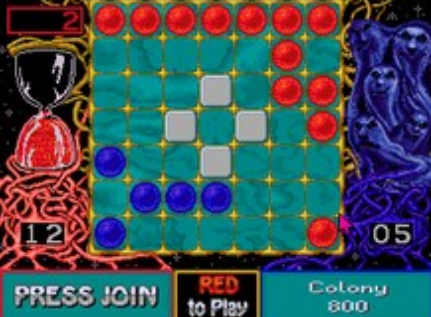

# Assegnazione Progetto

## Ataxx

• Videogioco di strategia del 1988
• Due giocatori competono su una griglia quadrata 7x7
• Lo scopo del gioco è che un giocatore abbia la maggioranza dei pezzi sul tabellone alla fine del gioco, 
convertendo il maggior numero possibile di pezzi dell'avversario

I due giocatori si alterneranno su un unico device Command Line Interface (CLI)
