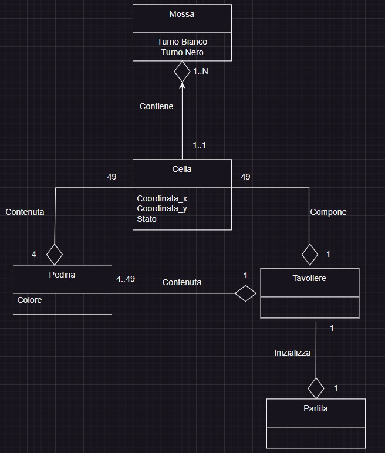
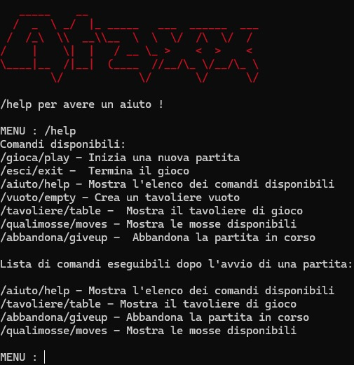
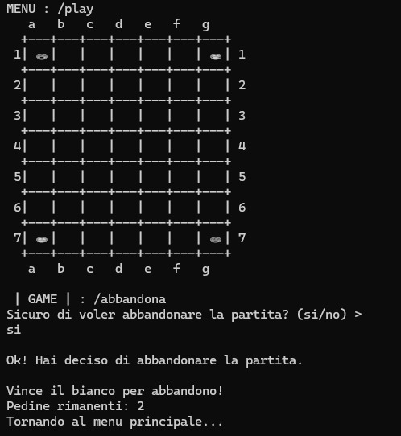
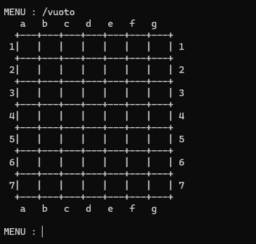
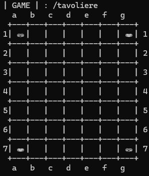
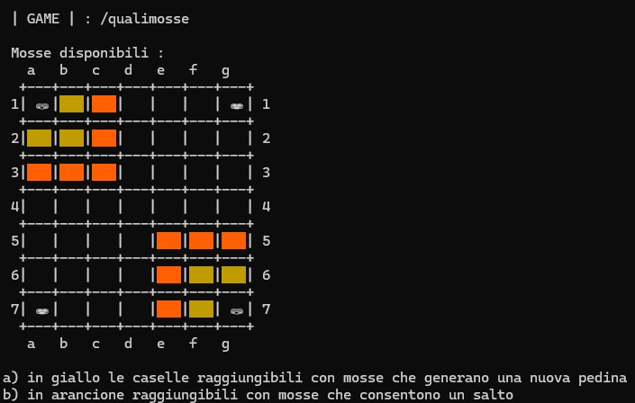
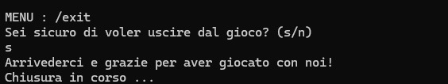
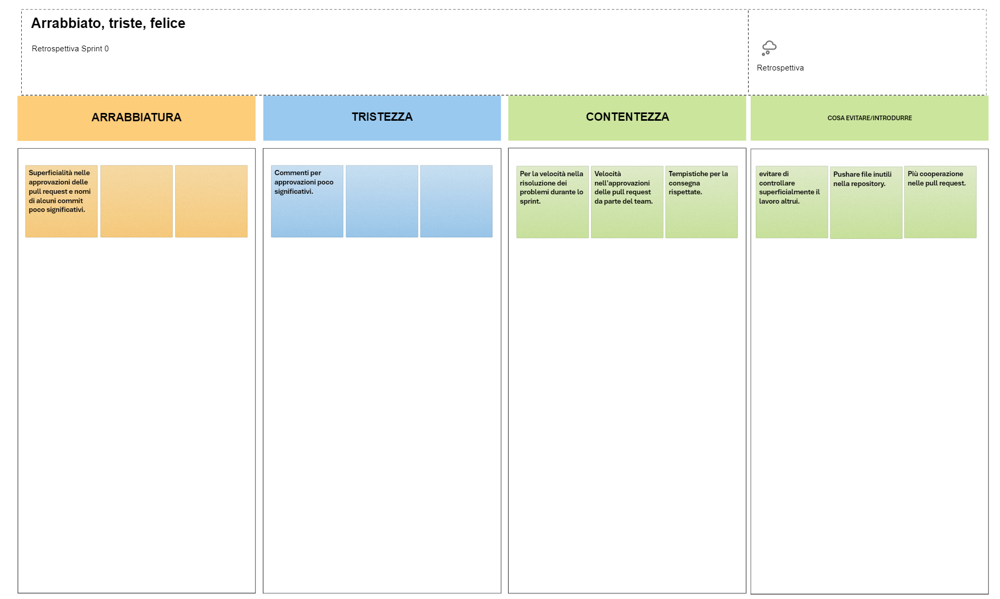

# ATAXX

### INDICE

1.)  [Introduzione](#1-introduzione)

2.)  [Modello di dominio](#2-modello-di-dominio)

3.)  [Requisiti specifici](#3-requisiti-specifici)

3.1) [Requisiti funzionali](#31-requisiti-funzionali)

3.2) [Requisiti non funzionali](#32-requisiti-non-funzionali)

7.)  [Manuale utente](#7-manuale-utente)

9.)  [Analisi retrospettiva](#9-analisi-retrospettiva)

9.1) [Analisi retrospettiva Sprint 0](#91-analisi-retrospettiva-sprint-0)

## 1.  INTRODUZIONE

Questo documento ha lo scopo di illustrare la prima versione dell'applicazione **ATAXX**.

Il programma attraverso un'interfaccia a linea di comando (**CLI**), permette all'utente di giocare  al gioco strategico **Ataxx**. Il software presenta una griglia in cui i giocatori devono espandere il proprio territorio muovendo le pedine sulle caselle adiacenti. L'obiettivo è conquistare il maggior numero di pedine possibili trasformando quelle avversarie in proprie. Il giocatore può scegliere di **saltare o duplicare le pedine** per ottenere vantaggi tattici. La partita termina quando non ci sono più mosse disponibili o tutte le caselle sono state occupate, e il vincitore è colui che possiede il maggior numero di pedine al termine del gioco.

 

## 2. MODELLO DI DOMINIO 

 

## 3. REQUISITI SPECIFICI

## 3.1 REQUISITI FUNZIONALI
Il software consente di :

  

-  ***#US1*** mostrare l'help con elenco comandi e regole del gioco 

-***Criteri di accettazione:*** 
Al comando ***/help*** o invocando l'app con flag --help o -h

il risultato è una descrizione concisa, che normalmente appare all'avvio del programma, seguita dalla lista di comandi disponibili, uno per riga.
 

-  ***#US2*** Iniziare una nuova partita

-***Criteri di accettazione:*** 
Al comando ***/gioca*** o ***/play***: se nessuna partira è in corso l'applicazione imposta le pedine in posizione iniziale,ossia agli angoli del tavoliere e si predispone a ricevere il primo tentativo o altri comandi.
 

-  ***#US3*** mostrare il tavoliere vuoto 

-***Criteri di accettazione:*** 
Al comando ***/vuoto*** o ***/empty***: l'applicazione risponde visualizzando, una griglia 7x7 vuota, con le righe numerate da A a G e le colonne numerate da 1 a 7.
 

-  ***#US4*** mostrare il tavoliere

- ***Criteri di accettazione:***
  Al comando ***/tavoliere*** o ***/table***: 

  • se il gioco non è iniziato l'app suggerisce il comando gioca

  • se il gioco è iniziato l'app mostra la posizione di tutte le pedine sul tavoliere; le pedine sono mostrate in formato Unicode [Wikipedia: English draughts Unicode](https://en.wikipedia.org/wiki/English_draughts#Unicode)

-  ***#US5*** visualizzare le mosse possibili di una pedina 

- ***Criteri di accettazione:***
  Al comando ***/qualimosse*** o ***/moves***:

  • se il gioco non è iniziato l'app suggerisce il comando gioca

  • se il gioco è iniziato l'app mostra quali mosse sono disponibili per il giocatore di turno, evidenziando:
    - a) in giallo le caselle raggiungibili con mosse che generano una nuova pedina
    - b) in arancione le caselle raggiungibili con mosse che consentono un salto

-  ***#US6*** abbandonare una partita

- ***Criteri di accettazione***
  Al comando ***/abbandona*** o ***/giveup***: l'applicazione chiede conferma 

  • se la conferma è positiva, l'applicazione comunica che il Nero(o Bianco) ha vinto per abbandono e dichiara come vincitore l'avversario per x a 0 dove x è il numero di pedine rimaste dell'avversario.

  • se la conferma è negativa, l'applicazione si predispone a ricevere nuovi tentativi o comandi.

-  ***#US7*** chiudere il gioco

- ***Criteri di accettazione:***
  Al comando ***/esci*** o ***/exit*** : l'applicazione chiede conferma

  • se la conferma è positiva, l'applicazione si chiude restituendo il controllo al sistema operativo.

  • se la conferma è negativa, l'applicazione si predispone a ricevere nuovi tentativi o comandi.

## 3.2 REQUISITI NON FUNZIONALI

  

  

Per eseguire correttamente il programma è necessario utilizzare un container **Docker** basato su Alpine Linux. Le **shell** compatibili sono:

  

  

- su **Windows**: Windows PowerShell, Git Bash;

  

  

- su **MacOS** e **Linux**: qualunque terminale con supporto a UTF-8 o UTF-16

  

  

>***Comando per l’esecuzione del container***

  

>Dopo aver eseguito il comando docker pull copiandolo da GitHub Packages, Il comando Docker da usare per eseguire il container contenente l’applicazione è:

  

  

>|>docker run --rm -it ghcr.io/softeng2324-inf-uniba/ataxx-micali:latest

 

## 7.MANUALE UTENTE

L'applicazione '**Ataxx**' mira a ricreare l'esperienza dell'omonimo videogioco di strategia, caratterizzato dalla simulazione su terminale del tavoliere  e di tutte le sue caratteristiche.

Per utilizzare l'applicazione è necessario eseguire i seguenti passaggi:

- scaricare e installare la distribuzione di **Docker** per la propria piattaforma software;

- scaricare il progetto da **GitHub Packages** tramite il comando

`docker pull ghcr.io/softeng2324-inf-uniba/ataxx-micali:latest`

- eseguire il programma tramite **Docker** attraverso il comando

`docker run --rm -it ghcr.io/softeng2324-inf-uniba/ataxx-micali:latest`

Quando il programma sarà avviato verrà visualizzato il messaggio "*/help per avere un aiuto*".

Ora il programma è in attesa di input.

 

### *(/help)*

Digitando il comando ***/help*** o ***-h*** oppure ***--help*** verrà visualizzato la lista dei comandi:

- con il comando ***/gioca*** o ***/play*** si può avviare una partita e posizionare le pedine sul tavoliere.
- con il comando ***/vuoto*** o ***/empty*** si può avviare visualizzare il tavoliere vuoto.
- con il comando ***/tavoliere*** o ***/table*** si può visulizzare la posizione di tutte le pedine sul tavoliere.
- con il comando ***/qualimosse*** o ***/moves*** si possono visulizzare le mosse disponibili per il giocatore di turno.
- con il comando ***/abbandona*** o ***/giveup*** si può abbandonare una partita in corso.
- con il comando ***/esci*** o ***/exit*** si può uscire dal gioco.
  

 ### *(/gioca)*

 

  ### *(/vuoto)*

 

 ### *(/tavoliere)*

 

  ### *(/qualimosse)*

 

   ### *(/esci)*

 

 

 

 

 

## 9. ANALISI RETROSPETTIVA

  
  

## 9.1 ANALISI RETROSPETTIVA SPRINT 0

  

La riunione ha avuto inizio con la revisione degli obiettivi dello sprint precedente. Tutte le storie utente previste sono state completate con successo.

Successivamente, abbiamo esaminato i punti di forza e le criticità dell'ultimo sprint. Il team ha riconosciuto come punto di forza un'efficace comunicazione tra i membri e una notevole collaborazione, soprattutto nel rispetto delle scadenze e nella tempestività nel gestire le problematiche. Tra le criticità, abbiamo individuato una certa superficialità nell'approvazione delle richieste di modifica e un'inadempienza alle regole stabilite nel codice di condotta.

Dopo aver discusso delle criticità, sono state proposte diverse soluzioni per migliorare il processo di sviluppo. Abbiamo deciso di evitare una revisione superficiale delle modifiche proposte nelle richieste di modifica e di non caricare file inutili sul branch main della repository remota.

Infine, abbiamo definito gli obiettivi per il prossimo sprint, che comprendono un maggiore impegno e collaborazione durante le richieste di modifica da parte di tutti i membri del team.

Conclusione:

La sessione si è conclusa con un feedback positivo da parte di tutti i membri del team. Siamo tutti determinati a lavorare insieme per migliorare costantemente il nostro processo di sviluppo e la qualità del software.

  

 

  

