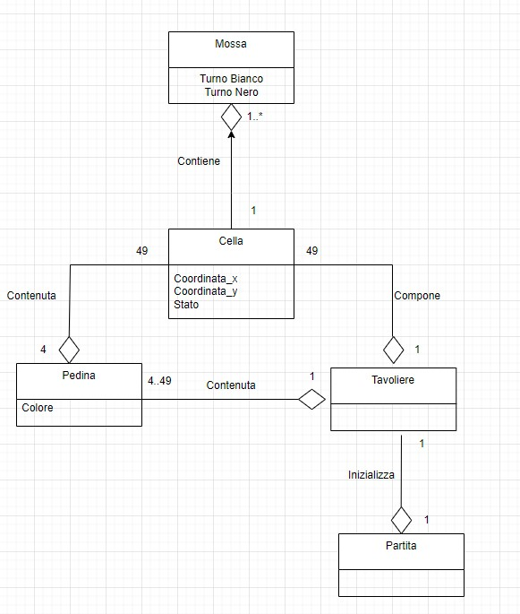
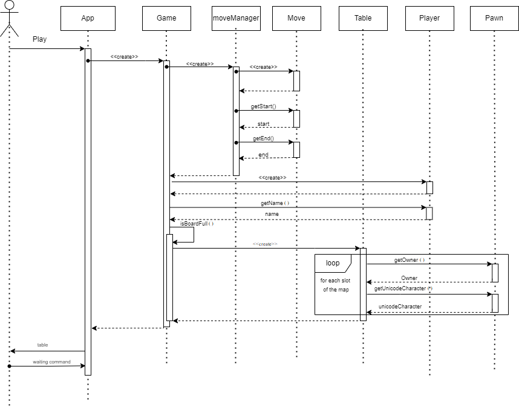

# ATAXX

  

### INDICE

  
  

1.) [Introduzione](#1-introduzione)

2.) [Modello di dominio](#2-modello-di-dominio)

3.) [Requisiti specifici](#3-requisiti-specifici)

3.1 [Requisiti funzionali](#31-requisiti-funzionali)

3.2 [Requisiti non funzionali](#32-requisiti-non-funzionali)

4.) [System Design](#4-system-design)

4.1 [Stile architetturale adottato](#41-stile-architetturale-adottato)

4.2 [Diagramma dei package](#42-diagramma-dei-package)

4.3 [Decisioni prese riguardo ai requisiti non funzionali](#43-decisioni-prese-riguardo-ai-requisiti-non-funzionali)

5.) [OO Design](#5-oo-design)

5.1 [Diagramma delle classi](#51-diagramma-delle-classi)

5.2 [Diagramma di sequenza](#52-diagramma-di-sequenza)

5.3 [Principi di OO](#53-principi-di-oo)

5.4 [Design pattern](#54-design-pattern)

6 ) [Riepilogo dei test](#6-riepilogo-dei-test)

7.) [Manuale utente](#7-manuale-utente)

8.) [Processo di sviluppo e organizzazione del lavoro](#8-processo-di-sviluppo--organizzazione-del-lavoro)

9.) [Analisi retrospettiva](#9-analisi-retrospettiva)

9.1 [Analisi retrospettiva Sprint 0](#91-analisi-retrospettiva-sprint-0)

9.2 [Analisi retrospettiva Sprint 1](#92-analisi-retrospettiva-sprint-1)

  
  

## 1.  INTRODUZIONE

Questo documento ha lo scopo di illustrare la prima versione dell'applicazione **ATAXX**.

Il programma attraverso un'interfaccia a linea di comando (**CLI**), permette all'utente di giocare  al gioco strategico **Ataxx**. Il software presenta una griglia in cui i giocatori devono espandere il proprio territorio muovendo le pedine sulle caselle adiacenti. L'obiettivo è conquistare il maggior numero di pedine possibili trasformando quelle avversarie in proprie. Il giocatore può scegliere di **saltare o duplicare le pedine** per ottenere vantaggi tattici. La partita termina quando non ci sono più mosse disponibili o tutte le caselle sono state occupate, e il vincitore è colui che possiede il maggior numero di pedine al termine del gioco.

 

## 2. MODELLO DI DOMINIO 

 

## 3. REQUISITI SPECIFICI

## 3.1 REQUISITI FUNZIONALI
Il software consente di :

  

-  ***#US1*** mostrare l'help con elenco comandi e regole del gioco 

-***Criteri di accettazione:*** 
Al comando ***/help*** o invocando l'app con flag --help o -h

il risultato è una descrizione concisa, che normalmente appare all'avvio del programma, seguita dalla lista di comandi disponibili, uno per riga.
 

-  ***#US2*** Iniziare una nuova partita

-***Criteri di accettazione:*** 
Al comando ***/gioca*** o ***/play***: se nessuna partira è in corso l'applicazione imposta le pedine in posizione iniziale,ossia agli angoli del tavoliere e si predispone a ricevere il primo tentativo o altri comandi.
 

-  ***#US3*** mostrare il tavoliere vuoto 

-***Criteri di accettazione:*** 
Al comando ***/vuoto*** o ***/empty***: l'applicazione risponde visualizzando, una griglia 7x7 vuota, con le righe numerate da A a G e le colonne numerate da 1 a 7.
 

-  ***#US4*** mostrare il tavoliere

- ***Criteri di accettazione:***
  Al comando ***/tavoliere*** o ***/table***: 

  • se il gioco non è iniziato l'app suggerisce il comando gioca

  • se il gioco è iniziato l'app mostra la posizione di tutte le pedine sul tavoliere; le pedine sono mostrate in formato Unicode [Wikipedia: English draughts Unicode](https://en.wikipedia.org/wiki/English_draughts#Unicode)
   

-  ***#US5*** visualizzare le mosse possibili di una pedina 

- ***Criteri di accettazione:***
  Al comando ***/qualimosse*** o ***/moves***:

  • se il gioco non è iniziato l'app suggerisce il comando gioca

  • se il gioco è iniziato l'app mostra quali mosse sono disponibili per il giocatore di turno, evidenziando:
    - a) in giallo le caselle raggiungibili con mosse che generano una nuova pedina
    - b) in arancione le caselle raggiungibili con mosse che consentono un salto
     

-  ***#US6*** abbandonare una partita

- ***Criteri di accettazione***
  Al comando ***/abbandona*** o ***/giveup***: l'applicazione chiede conferma 

  • se la conferma è positiva, l'applicazione comunica che il Nero(o Bianco) ha vinto per abbandono e dichiara come vincitore l'avversario per x a 0 dove x è il numero di pedine rimaste dell'avversario.

  • se la conferma è negativa, l'applicazione si predispone a ricevere nuovi tentativi o comandi.
   

-  ***#US7*** chiudere il gioco

- ***Criteri di accettazione:***
  Al comando ***/esci*** o ***/exit*** : l'applicazione chiede conferma

  • se la conferma è positiva, l'applicazione si chiude restituendo il controllo al sistema operativo.

  • se la conferma è negativa, l'applicazione si predispone a ricevere nuovi tentativi o comandi.
   

-  ***#US8*** impostare caselle non acessibili

- ***Criteri di accettazione:***

Al comando ***/bloccaxn*** o ***/blockxn***:

- **A partita non in corso**:
  - Al comando `/blocca xn`, dove `xn` sono le coordinate di una casella, la casella `xn` non è accessibile per le pedine ed è mostrata sul tavoliere con uno sfondo grigio.

- **Non è possibile bloccare**:
  - Le caselle di partenza del gioco.
  - Tutte le caselle adiacenti a una casella di partenza del gioco, rendendo impossibile la mossa di espansione di una pedina a inizio gioco.
  - Tutte le caselle a distanza 2 da una casella di partenza del gioco, rendendo impossibile la mossa di salto di una pedina a inizio gioco.

- **Limite di blocco**:
  - Non è possibile bloccare più di 9 caselle.

  -  ***#US9*** mostrare il tempo di gioco

- ***Criteri di accettazione:***
  Al comando ***/tempo*** o ***/time*** : 
  l'applicazione  mostra il tempo trascorso dall’inizio partita nel formato ore:minuti:secondi.
   

 -  ***#US10*** giocare una nuova pedina in una casella adiacente a una propria pedina

- ***Criteri di accettazione:***
A partita in corso di gioco, l'applicazione deve accettare che il giocatore di turno giochi sul tavoliere una nuova pedina ((bianca o nera) in una casella adiacente (in senso ortogonale e diagonale) ad un'altra in cui vi sia già una propria pedina, utilizzando una notazione algebrica del tipo: a1-a2, dove a1 è la casella di partenza e a2 è la casella adiacente.
   

 -  ***#US11***  spostare una propria pedina saltando una casella adiacente

- ***Criteri di accettazione:***
A partita in corso di gioco, l'app deve accettare che il giocatore di turno sposti sul tavoliere una propria pedina ((bianca o nera) con il salto di una casella adiacente, utilizzando una notazione algebrica del tipo: a1-a3, dove a1 è la casella di partenza e a3 è la casella di arrivo..
La casella di arrivo deve essere libera e non deve essere adiacente alla casella originaria.
La casella saltata può anche essere occupata da una propria pedina o da una pedina avversaria.
   

 -  ***#US12*** catturare una pedina avversaria come effetto di una mossa

- ***Criteri di accettazione:***
Se al termine di una mossa vi sono pedine avversarie adiacenti alla casella di arrivo, sia per la mossa di espansione che di spostamento, queste vengono catturate cambiando di colore.
   

  
-  ***#US13*** mostrare le mosse giocate

- ***Criteri di accettazione:***
  Al comando ***/mosse*** o ***/oldmoves*** : 
  Al comando /mosse, l'app mostra la storia delle mosse con notazione algebrica, per esempio: 
  1. a1-a2 (N); 2. g7-g6 (B);
   

 -  ***#US14*** passare il turno per impossibilità di movimento

- ***Criteri di accettazione:***
 Se il giocatore non può muovere nessuna pedina del proprio colore, l’app avvisa che il turno passa all’altro colore.
   

-  ***#US15*** visualizzare il fine partita con il vincitore e i punti segnati

- ***Criteri di accettazione:***
Se nessuna pedina può essere mossa perché le caselle del tavoliere sono state tutte riempite,
allora l’app dichiara il vincitore (Bianco o Nero) e riporta i punti del Bianco e Nero contando le rispettive pedine.
   

## 3.2 REQUISITI NON FUNZIONALI

  

  

Per eseguire correttamente il programma è necessario utilizzare un container **Docker** basato su Alpine Linux. Le **shell** compatibili sono:

  

  

- su **Windows**: Windows PowerShell, Git Bash;

  

  

- su **MacOS** e **Linux**: qualunque terminale con supporto a UTF-8 o UTF-16

  

  

>***Comando per l’esecuzione del container***

  

>Dopo aver eseguito il comando docker pull copiandolo da GitHub Packages, Il comando Docker da usare per eseguire il container contenente l’applicazione è:

  

  

>|>docker run --rm -it ghcr.io/softeng2324-inf-uniba/ataxx-micali:latest

 

## 4. SYSTEM DESIGN

### 4.1 STILE ARCHITETTURALE ADOTTATO
Il programma è stato sviluppato in **Java**, un linguaggio di programmazione multipiattaforma e orientato agli oggetti, che permette di eseguire programmi in maniera indipendente dal Sistema Operativo e dell'hardware sottostante.

Per il controllo di versione è stato utilizzato un repository privato su **GitHub**; per la compilazione è stato utilizzato **Gradle**, un sistema per l'automazione dello sviluppo.

Oltre al compilatore, la **toolchain** comprende: 

- **CheckStyle**, per il controllo dello stile di programmazione del codice;
- **SpotBugs**, per l'analisi statica e l'individuazione di pattern di errori ricorrenti;
- **Pmd**, per l'analisi statica e l'individuazione di pattern errati esclusivamente nelle test suite JUnit;
- **JUnit**, per il test di unità automatizzato tramite asserzioni;

In più, per l'integrazione continua, tramite **GitHub Actions** vengono costruite e pubblicate automaticamente, in corrispondenza di ogni pull request, le immagini **Docker** dell'applicazione sul repository **GitHub Packages**. 

Lo stile architetturale scelto nello specifico per il progetto è il modello ***Entity - Controll - Boundary***.

Essa è composta da tre componenti principali:
- ***Le entità (Entity)*** ovvero le classi responsabili delle persistenza dei dati incapsulati dall'astrazione, che prevalentemente effettuano operazioni di tipo get e set sugli attributi. 
- ***I controllori (Control)*** ovvero le classi responsabili del flusso di controllo delle user story contenenti la logica dell'applicazione
- ***Le Boundary*** ovvero le classi che rappresentano un interfaccia con il mondo esterno e responsabili della comunicazione con un attore.    

Ognuno di questi componenti ha un ruolo ben definito nel sistema, in modo tale da fornire una struttura organizzativa chiara e una separazione delle responsabilità all'interno del sistema. Questo stile architetturale favorisce una gestione efficiente dei dati e una chiara interazione con il mondo esterno.

 

### 4.2 DIAGRAMMA DEI PACKAGE

Il diagramma dei package mostrato nella figura qui sopra raffigura le relazioni tra i package della directory specifica`src.main.java.it.uniba`

 

### 4.3 DECISIONI PRESE RIGUARDO AI REQUISITI NON FUNZIONALI

Oltre a #RNF1, si è presa la decisione di settare la codifica in input dei caratteri a UTF-8 direttamente da java, così che possano essere supportati tutti i caratteri inseriti nel gioco.
 
Per quanto riguarda la leggibilità del software, sono stati rispettati tutti i criteri CheckStyle, così da garantire uno stile di programmazione uniforme.

L'affidabilità del software è garantita dalla risoluzione di ogni Spotbugs riscontrato nelle fasi di sviluppo del programma.

 

## 5. OO DESIGN  

### 5.1 DIAGRAMMA DELLE CLASSI
Diagramma delle classi user story ***#US3***:

Diagramma delle classi user story ***#US9***:

Diagramma delle classi user story ***#US15***:

Diagramma delle classi user story ***#US13***:

### 5.2 DIAGRAMMA DI SEQUENZA

Diagramma di sequenza  user story ***#US3***:

Diagramma di sequenza user story ***#US9***:

Diagramma di sequenza user story ***#US15***:

 

### 5.3 PRINCIPI DI OO

Per quanto riguarda le decisioni prese per  l'OO design, si è cercato di rispettare il principio di presentazione separata andando a creare una classe utilitaria.
Si è cercato di rispettare il principio della ***Single Responsibility***, il quale afferma che ongni classe dovrebbe essere responsabile di un'unica responsabilità o compito. Per favorire un alta coesione e bassa dipendenza tra le classi.
*Game.java* e *MoveManager.java* gestiscono la logica del gioco, mentre invece gli enumerativi definiscono gli elementi del gioco.

Si è cercato di rispettare anche il principio di ***Open/Closed***, per il quale le classi, moduli, funzioni, dovrebbero essere aperte all'estensione e non chiuse. Infatti non è stato modificato del codice esistente, ma è stato esteso il comportamente attraverso l'ereditarietà, l'implementazione di interfacce o la composizione.

Sicuramente è stato applicato anche il principio dell'***Information Hiding*** in tutte le classi e anche il principio ***DRY (Do Not Repeat Yourself)*** . Per evitare il DRY è stata ridefinito il parser dei comandi.
 

## 5.4 DESIGN PATTERN

Nel codice, la classe `PlayTime` è implementata come un'enumerazione, ma utilizza un approccio particolare per creare un Singleton attraverso la dichiarazione di un'istanza di enumerazione denominata "INSTANCE". Il motivo per cui `PlayTime` è implementato come enumerazione anziché una classe con pattern Signleton, è per garantire una maggiore sicurezza (perchè gli oggeti enumerativi vengono inizializzati in modo sicuro e thread-safe dal caricatore di classi) e  facilità da testare (perché l'oggetto PlayTime può essere "mocked or stubbed" nei test unitari). Garantisce anche di evitare i problemi di Spotbugs come `"Public static it.uniba.features.PlayTime.getInstance() may expose internal representation by returning PlayTime.instance  At SpotBugs ended with exit code 1"` (perchè enumerativi sono progettati per rappresentare un insieme limitato di istanze uniche e immutabili), che può portare a problemi di manutenibilità e comportamento imprevisto nel codice. Quindi, l'utilizzo del Singleton in questo caso specifico è finalizzato a garantire che ci sia una sola istanza di "PlayTime" all'interno dell'applicazione. I metodi all'interno della classe `PlayTime` che utilizzano l'instanza Singleton sono:

- L'instanza Singleton viene utilizzata da metodi come   `getElapsedTime()`, `start()` e `stop()`, per ottenere informazioni sul tempo rimanente, tempo trascorso, tempo totale e per controllare l'avvio o l'interruzione del timer.

- Il metodo `isRunning()` per verificare se il timer è in esecuzione o meno, basandosi sul tempo rimanente.

Anche un'altra classe, Table, è implementata come un'enumerazione. Questo approccio offre gli stessi vantaggi in termini di sicurezza e facilità di test. Utilizzare una classe enumerativa garantisce che ci sia una sola istanza di Table all'interno dell'applicazione, prevenendo problemi di concorrenza e migliorando la manutenibilità del codice.

 

## 6. RIEPILOGO DEI TEST

Sono stati sviluppati *26 casi di test* che coinvolgono le classi:
- AppTest.java
- GameTest.java
- PlayTimeTest.java
- TableTest.java

Inoltre i casi di test sono stati posizionati nel package  `src.test.java.it.uniba` in modo tale da rispettare la stessa gerarchia delle classi nel package `src.main.java.it.uniba`

 

## 7.MANUALE UTENTE

L'applicazione '**Ataxx**' mira a ricreare l'esperienza dell'omonimo videogioco di strategia, caratterizzato dalla simulazione su terminale del tavoliere  e di tutte le sue caratteristiche.

Per utilizzare l'applicazione è necessario eseguire i seguenti passaggi:

- scaricare e installare la distribuzione di **Docker** per la propria piattaforma software;

- scaricare il progetto da **GitHub Packages** tramite il comando

`docker pull ghcr.io/softeng2324-inf-uniba/ataxx-micali:latest`

- eseguire il programma tramite **Docker** attraverso il comando

`docker run --rm -it ghcr.io/softeng2324-inf-uniba/ataxx-micali:latest`

Quando il programma sarà avviato verrà visualizzato il messaggio "*/help per avere un aiuto*".

Ora il programma è in attesa di input.

 

### *(/help)*

Digitando il comando ***/help*** o ***-h*** oppure ***--help*** verrà visualizzato la lista dei comandi:

- con il comando ***/gioca*** o ***/play*** si può avviare una partita e posizionare le pedine sul tavoliere.
- con il comando ***/vuoto*** o ***/empty*** si può avviare visualizzare il tavoliere vuoto.
- con il comando ***/tavoliere*** o ***/table*** si può visulizzare la posizione di tutte le pedine sul tavoliere.
- con il comando ***/qualimosse*** o ***/moves*** si possono visulizzare le mosse disponibili per il giocatore di turno.
- con il comando ***/abbandona*** o ***/giveup*** si può abbandonare una partita in corso.
- con il comando ***/esci*** o ***/exit*** si può uscire dal gioco.
- con il comando ***/tempo*** o ***/times*** viene mostrato il tempo di gioco.
- con il comando ***/mosse*** o ***/oldmoves*** viene mostrato lo storico delle mosse.
- con il comando ***/bloccaxn*** o ***/blockxn*** si possono impostare caselle non accessibili.
 

 ### *(/gioca)*

 

  ### *(/vuoto)*

 

 ### *(/tavoliere)*

 

  ### *(/qualimosse)*

 

   ### *(/esci)*

 

 ### *(/bloccaxn)*

 

  ### *(/tempo)*

 

   ### *(/mosse)*

 

 
 

  

 ## 8. PROCESSO DI SVILUPPO & ORGANIZZAZIONE DEL LAVORO

Il progetto che abbiamo realizzato consiste nel creare il gioco ***Ataxx***, a riga di comando in **Java**. Il processo di sviluppo e organizzazione del lavoro è stato il seguente: abbiamo suddiviso il progetto in tre fasi principali, ovvero: analisi, progettazione e implementazione. (ripetuto per ogni sprint). Nella fase di analisi, abbiamo studiato le regole del gioco, i requisiti funzionali e non funzionali, e i casi d'uso. Abbiamo anche definito le classi principali e le loro relazioni. Nella fase di progettazione, abbiamo definito le classi e i metodi necessari per implementare la logica del gioco, l'interfaccia utente e la gestione degli elementi di gioco. Nella fase di implementazione, abbiamo scritto il codice java seguendo le convenzioni di stile e i principi di programmazione orientata agli oggetti. Abbiamo anche effettuato dei test per verificare il corretto funzionamento del programma. Nella fase di testing, abbiamo eseguito dei test unitari e di integrazione per verificare il corretto funzionamento del programma e la sua conformità alle specifiche. Abbiamo anche effettuato dei test di usabilità con degli utenti esterni per valutare l'esperienza d'uso del gioco.

Tutte le decisioni sono state prese di comune accordo; le problematiche sono state gestite tramite gli strumenti offerti da **GitHub** e discusse quando possibile su piattaforme online quali **WhatsApp** e **Telegram**.

All'inizio di ogni nuovo sprint, il team si è riunito in un meeting di pianificazione per organizzare il lavoro da svolgere (attraverso le **Project Board**) e suddividere i task tra i membri del team. In particolare è stato necessario individuare le dipendenze tra i singoli task e stabilire l'ordine in cui completarli. 

Lavorare in maniera agile ha favorito il rispetto dei tempi di consegna e ha contribuito a migliorare la collaborazione e l'affiatamento tra i membri del team.

All'inizio di ogni pomeriggio di sviluppo, ogni membro del team aggiornava gli altri sul lavoro svolto in precedenza ed informava il resto del team di eventuali problematiche riscontrate. Inoltre ci si confrontava sul lavoro ancora da svolgere, scambiando idee su come proseguire in maniera ottimale.

I task più complessi sono stati svolti in video call su **Meet**. Il lavoro svolto veniva poi approvato da chi non era presente, dopo essere stato adeguatamente revisionato.

Alla fine di ogni sprint, prima della consegna, il team si riuniva per controllare che il lavoro fosse stato svolto nel miglior modo possibile, così da evitare problemi con una ricaduta negli sprint successivi. Dopo la consegna, si discuteva di come poter migliorare l'interazione e il lavoro del team.

 

 

 

 

## 9. ANALISI RETROSPETTIVA

  
  

## 9.1 ANALISI RETROSPETTIVA SPRINT 0

  

La riunione ha avuto inizio con la revisione degli obiettivi dello sprint precedente. Tutte le storie utente previste sono state completate con successo.

Successivamente, abbiamo esaminato i punti di forza e le criticità dell'ultimo sprint. Il team ha riconosciuto come punto di forza un'efficace comunicazione tra i membri e una notevole collaborazione, soprattutto nel rispetto delle scadenze e nella tempestività nel gestire le problematiche. Tra le criticità, abbiamo individuato una certa superficialità nell'approvazione delle richieste di modifica e un'inadempienza alle regole stabilite nel codice di condotta.

Dopo aver discusso delle criticità, sono state proposte diverse soluzioni per migliorare il processo di sviluppo. Abbiamo deciso di evitare una revisione superficiale delle modifiche proposte nelle richieste di modifica e di non caricare file inutili sul branch main della repository remota.

Infine, abbiamo definito gli obiettivi per il prossimo sprint, che comprendono un maggiore impegno e collaborazione durante le richieste di modifica da parte di tutti i membri del team.

Conclusione:

La sessione si è conclusa con un feedback positivo da parte di tutti i membri del team. Siamo tutti determinati a lavorare insieme per migliorare costantemente il nostro processo di sviluppo e la qualità del software.

  

 

  

## 9.2 ANALISI RETROSPETTIVA SPRINT 1

  
  

La riunione è iniziata con la verifica degli obiettivi dello sprint precedente. Siamo riusciti a completare tutte le user story previste.

  

Inizialmente si è discusso sulla revisione superficiale delle commit inerenti a modifiche nelle Pull Request da parte dei componenti del team; inoltre è emerso che continuano ad esserci dei messaggi non molto esplicativi nelle commit. E'stato fatto anche un commento anche sulla qualità del codice, in quanto non risultava, in alcune classi, manutenibile a lungo termine.

  

Successivamente sono emerse le problematiche che hanno reso i componenti del team alquanto tristi, ad esempio si è riscontrata ambiguità nei criteri di accettazione di alcune user story e poca velocità nell'approvazione delle Pull Request.

  

Continuando sono emersi gli aspetti che hanno contribuito alla contentezza generale del team, come ad esempio un ottimo spirito collaborativo del team, la consegna del risultato dello Sprint 1 entro il termine di scadenza e l'efficace risoluzione di tutti i problemi emersi durante lo sviluppo.

  

Infine, abbiamo definito gli obiettivi per il prossimo sprint, che includono una maggiore collaborazione nello svuluppo del report finale, una maggiore attenzione riguardo i Definition of Done per lo Sprint 2 e di evitare di pushare del codice sorgente che presenta ancora errori CheckStyle e Spotbugs.

  

Conclusione:

  

Nel complesso, lo sprint è stato positivo, nonostante alcuni punti da migliorare e nonostante la perdita di un  punto per errori relativamente stupidi. Il gruppo ha raggiunto gli obiettivi prefissati, ha lavorato bene insieme e ha creato codice di discreta qualità. Nelle prossime fasi dello sviluppo, ci aspettiamo un miglioramento continuo grazie alle azioni correttive identificate.

  

 

  

  

